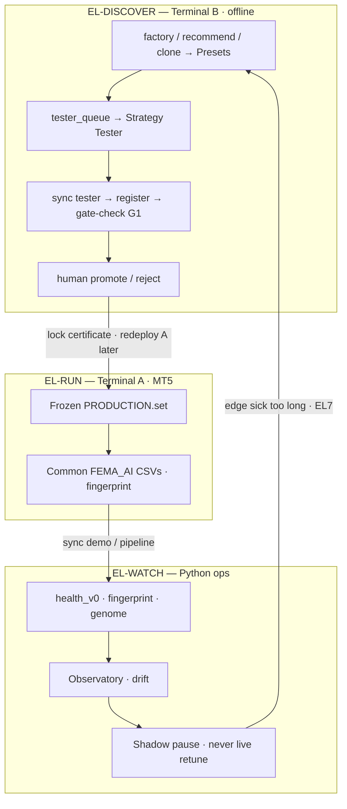
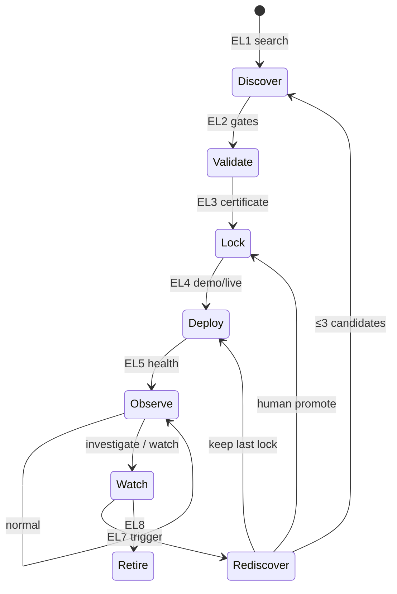

# FEMA

**Floating EMA Grid — EURUSD M5**

> Discovery finds the edge. The EA runs it frozen. Health watches fade.  
> Only a new Discovery cycle may replace PRODUCTION — AI never reinvents the engine live.

```text
  MT5 executes  ·  Python thinks  ·  Human promotes
```

| | |
| --- | --- |
| **Locked stack** | `FEMA_EURUSD_M5_PRODUCTION` · alias `P2C-001_REG_ADX30` |
| **EA build** | v1.26 |
| **Strategy** | Pullback continuation · floating ATR grid · basket TP/SL |
| **Lock window** | 2026.01.01 → 2026.07.31 · EURUSD M5 · $400 · every tick |
| **Birth** | PF **1.36** · WR **~71%** · DD **~18%** bal · lock `20260101_PRODUCTION_13c52cd9` |
| **Ops** | Waves 0–5 shipped · Wave 6 park-freeze · AER `P0`–`P6` tooling live · `fema_ops pipeline` |

**Start here:** [`AI/STATUS.md`](AI/STATUS.md) · spine [`edgelifecycle.md`](edgelifecycle.md) · audit [`system_audit.md`](system_audit.md) · ops [`infrascaleup.md`](infrascaleup.md) · rediscovery [`automated_edge_rediscovery_pipeline.md`](automated_edge_rediscovery_pipeline.md) · edge [`System Profile EURUSD.md`](System%20Profile%20EURUSD.md)

---

## The edge in one screen

**Hypothesis.** In an EMA20 / EMA100 trend, shallow ATR-spaced pullbacks revert enough to hit **+$10 basket TP** often enough that **−$25 basket SL** keeps expectancy positive.

```text
                         trend bias (EMA20 vs EMA100)
                                    │
                                    ▼
              ┌─────────────────────────────────────┐
              │   floating grid · ATR×1.0 · 5 lvl   │
              │   market fills · 1 fill / level     │
              └──────────────────┬──────────────────┘
                                 │
              ┌──────────────────┼──────────────────┐
              ▼                                     ▼
        basket TP +$10                        basket SL −$25
        (many small wins)                     (cap steamroller)
                                 │
                                 ▼
                    ADX(14) < 30 gate on new entries
```

| Layer | Locked behaviour |
| --- | --- |
| Bias | Buy grids in uptrend only · sell grids in downtrend only |
| Center | EMA20 · rebuild if shift ≥ 0.25×ATR |
| Spacing | ATR(14)×1.0 · max 5 opens · no pendings |
| Exit | Whole-basket TP **$10** / BSL **$25** (no per-leg SL) |
| Regime | Block new entries when ADX ≥ **30** |
| Size | 0.01 lots · spread ≤ 30 pts · short cooldown |
| **Off** | HTF · ATR% · session filters · RTE · trail · candle · RSI |

**Thrive:** mild trend / ADX&lt;30 · shallow L1–L2 · Asia included · MAE under BSL.  
**Die:** steamroller / high ADX · deep grids · London/NY-only · other symbols (GBPUSD same stack → PF 0.80).

**Lineage:** `P1-BASELINE` → `P2A-002_BSL_25` → **PRODUCTION = BSL25 + ADX30**.

---

## Architecture — three layers (do not mix jobs)

**Hardware:** two **local** MT5 terminals — **A** = PRODUCTION chart, **B** = Discovery Tester. No VPS.  
**Re-Discovery status (2026-07-13):** phases `AER-P0`…`AER-P6` tooling complete; PRODUCTION lock unchanged. Runbook: [`automated_edge_rediscovery_pipeline.md`](automated_edge_rediscovery_pipeline.md).



```text
Terminal A — PRODUCTION          Terminal B — Discovery (Tester)
Chart: PRODUCTION.set            Strategy Tester · queued .set
Common\Files\FEMA_AI             Tester\...\Agent-*\...\FEMA_AI
        │ sync demo                        │ sync tester
        └────────────► fema_ops ◄──────────┘
                 health | gate-check
                        │
                 human promote? ──no──► keep lock
                                └──yes─► new certificate → redeploy A
```

| Layer | Terminal / host | Owns | Must not |
| --- | --- | --- | --- |
| **Discover** | **B** (second local) | Queue · Tester · G1 · KB · human promote | Touch demo path · auto-promote · TV as authority |
| **Run** | **A** (primary) | Locked PRODUCTION execution + Common CSVs | Self-retune · Discovery Optimizer mid-basket |
| **Watch** | Python / Docker ops | “Is *this* certificate still true?” | Redesign strategy in `OnTick` · live lots/TP/SL |

**Hard rules:** never point demo health at tester CSVs; ≤3 candidates / EL7 wave; one-subsystem diffs; promote only via checklist ([`AI/templates/promotion_checklist.md`](AI/templates/promotion_checklist.md)).

---

## Birth certificate

Canonical tester birth (mt5_deals) — health compares **rolling live/demo** to these bands, not to multi-year collect PF.

| Metric | Value |
| --- | ---: |
| Profit factor | **1.36** |
| Net profit | +$221 on $400 |
| Max DD balance / equity | 18% / 21% |
| Win rate | ~71% |
| Trades | 424 |
| Sharpe (approx) | 1.9 |
| Avg depth / bars alive | ~3.94 / ~320.5 M5 bars |
| Baskets / day | ~0.60 |

Fingerprint must match journal: `adx_gate=on` · `bsl=25` · `InpAdxMax=30`.  
Without ADX you get bare BSL_25 (PF ~1.27) — **not** PRODUCTION.

Data: [`AI/certificate_PRODUCTION_EURUSD.json`](AI/certificate_PRODUCTION_EURUSD.json) · confirm [`AI/kb/el3_lock_confirm.md`](AI/kb/el3_lock_confirm.md)

---

## What failed Discovery (and why that matters)

The edge is as much about **what was rejected** as what locked:

| Idea | Result |
| --- | --- |
| Return-to-EMA exit (RTE) | PF ~0.54 |
| HTF EMA200 filter | PF ~0.79–0.85 |
| Wider ATR spacing | PF ~0.93–1.08 |
| London/NY-only sessions | PF ~1.05 · DD ~40% (Asia lost) |
| Basket trail | Cuts winners |
| Candle / RSI filters | Weak / high DD |
| Same stack on GBPUSD | G3 fail · PF 0.80 |

Full lab log: [`Edge Discovery.md`](Edge%20Discovery.md)

---

## Ops Plane — AI enhancements (what “AI” means here)

Not ML driving lots/TP/SL. It means an **offline Edge Operations Platform**:

| Module | What it does | CLI / artifact |
| --- | --- | --- |
| **Health Engine** | Certificate `health_v0` · windows 50/100/250 · ladder | `fema_ops health` |
| **Observatory** | Daily note · default *do nothing* | `fema_ops observatory` |
| **Fingerprint × Genome** | Is market still the edge’s habitat? (shadow) | `fema_ops fingerprint` |
| **Drift** | Birth / component / compat alerts | `fema_ops drift` |
| **Factory** | ≤3 subsystem suggests · human clones | `recommend` · `factory` |
| **KB / Lineage** | Runs · gates · experiments · parent/child | `AI/kb/` |
| **Archive + API** | Immutable blobs · Postgres · read-only API | `ops/` · `db-rehydrate` |
| **Pipeline** | One command daily chain | `fema_ops pipeline` |
| **CI** | Cert / gates / FP / OpenAPI (no promote) | `fema_ops ci-gates` |

```powershell
cd AI
python -m fema_ops pipeline              # daily ops
python -m fema_ops pipeline --with-ci
python -m fema_ops pipeline --with-db    # if FEMA_DATABASE_URL set
```

Skips health cleanly when demo CSV is header-only; after first closed basket, re-run for `on_demo_path`.

---

## Lifecycle (living edge, not eternal edge)



| Phase | Job |
| --- | --- |
| EL0–EL3 | Baseline → search → gates → lock |
| EL4 | Demo path · Common `FEMA_AI` · ingest |
| EL5 | Rolling health · Observatory (shadow) |
| EL6 | Pause-new wire — **NOT SIGNED** (default off) |
| EL7 | Re-Discovery when ladder + persistence say so |
| EL8 | Retire / archive · one active lock |

Pause may stop **new** baskets only; open baskets stay under engine exits.  
RACI: [`AI/kb/raci.md`](AI/kb/raci.md) · parks: [`AI/kb/wave6_park_freeze.md`](AI/kb/wave6_park_freeze.md)

---

## Repository map

```text
FEMA/
├── FEMA.mq5                 # EA entry
├── Include/                 # Engine · AI logger · risk · grid
├── Presets/
│   ├── PRODUCTION.set       # Locked deploy inputs
│   └── manifest.json
├── AI/                      # Offline ops (fema_ops)
│   ├── fema_ops/            # health · FP · factory · pipeline · CI
│   ├── kb/                  # certificate siblings · lineage · genome · runs
│   ├── schemas/             # telemetry + market fingerprint
│   ├── templates/           # daily / pipeline runbooks
│   ├── STATUS.md            # operator glance
│   └── data/live/           # pointers (CSVs gitignored)
├── ops/                     # Docker Postgres + read-only API + sync + tester queue
├── edgelifecycle.md         # ★ spine
├── system_audit.md          # Main/subsystem map · status · improvements
├── infrascaleup.md          # Ops Plane roadmap §16
├── automated_edge_rediscovery_pipeline.md  # Terminal A/B Discovery (AER-P*)
├── System Profile EURUSD.md # Edge / trade profile
├── Edge Discovery.md        # Lab table
└── edgecontainment.md       # Vision · bands · ladder
```

---

## Quick start

### Strategy Tester (lock reproduction)

1. Compile `FEMA.mq5` in MetaEditor (**v1.26**).
2. Load `Presets/PRODUCTION.set` / `FEMA_EURUSD_M5_PRODUCTION.ini`.
3. Window **2026.01.01 – 2026.07.31** · EURUSD M5 · $400 · every tick · `ProfitInPips=0`.
4. Journal must show: `adx_gate=on` · `bsl=25` · build **1.26**.
5. CSVs → `Terminal\Common\Files\FEMA_AI\` (demo) or Tester Agent path (Discovery only).

### Demo + ops

```powershell
cd AI
python -m fema_ops ingest --source demo
python -m fema_ops pipeline
python -m fema_ops status
```

### Discovery (Terminal B — AER)

Two-terminal Re-Discovery is live (`AER-P0`…`P6`). Night/morning loop:

```powershell
powershell -File ops\tester_queue\el7_enqueue.ps1 -Force -Max 3   # or omit -Force when ladder opens
powershell -File ops\tester_queue\drain.ps1 -Max 3
powershell -File ops\tester_queue\scorecard.ps1
powershell -File ops\tester_queue\decision.ps1 -Preset <id> -PF <pf> -DD <dd> -Decision Reject -Signer "operator"
```

Details: [`ops/tester_queue/README.md`](ops/tester_queue/README.md) · [`automated_edge_rediscovery_pipeline.md`](automated_edge_rediscovery_pipeline.md)

### Docker Ops API (optional)

```powershell
docker-compose -f ops/docker-compose.yml up -d
docker-compose -f ops/docker-compose.yml run --rm fema_ops db-migrate
# curl -H "Authorization: Bearer fema-dev-token" http://localhost:8080/v1/status
```

Details: [`ops/README.md`](ops/README.md) · [`AI/README.md`](AI/README.md)

---

## Explicit non-goals (Wave 6 parks)

| Parked | Substitute |
| --- | --- |
| Auto-promote PRODUCTION | Human EL2/EL3 + checklist |
| Live EMA / TP / SL / lot from AI | Offline factory → Tester → human |
| MT5 inside Docker / K8s farm | Windows tester queue |
| Model retrain → live risk | Shadow health / fingerprint / drift |
| EC2 open-time predictor as spine | Rolling `health_v0` |
| Full multi-EA UI | Read-only API + STATUS + Observatory |

---

## Doc hierarchy

| Doc | Role |
| --- | --- |
| [`edgelifecycle.md`](edgelifecycle.md) | **Spine** — charter · INF · EL phases |
| [`system_audit.md`](system_audit.md) | Main systems · subsystems · status · improvement backlog |
| [`automated_edge_rediscovery_pipeline.md`](automated_edge_rediscovery_pipeline.md) | Terminal A/B Re-Discovery · `AER-P0`…`P6` **complete** (2026-07-13); lock unchanged |
| [`infrascaleup.md`](infrascaleup.md) | Ops Plane · Waves 0–6 |
| [`AI/STATUS.md`](AI/STATUS.md) | Operator / agent glance |
| [`System Profile EURUSD.md`](System%20Profile%20EURUSD.md) | Edge / trade / performance profile |
| [`Edge Discovery.md`](Edge%20Discovery.md) | Full Discovery table |
| [`edgecontainment.md`](edgecontainment.md) | Vision · bands · action ladder |
| [`AI/kb/platform_modules.md`](AI/kb/platform_modules.md) | Module map |
| [`aiedgecontain.md`](aiedgecontain.md) / [`ai_enhance.md`](ai_enhance.md) | Archives — not competing spines |

---

## Requirements

- MetaTrader 5 (hedging or netting — validate on your broker)
- EURUSD M5
- Python 3.11+ for `AI/fema_ops` (see `AI/requirements.txt`)
- Optional: Docker Desktop for Postgres + read-only API

---

## License

See repository owner for terms.
