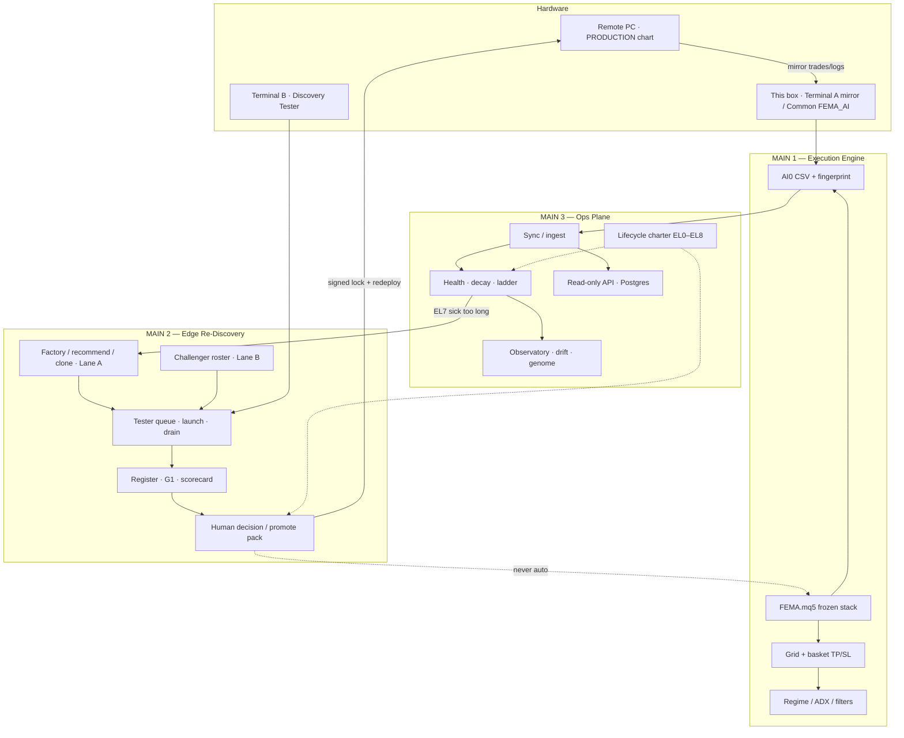

# FEMA — System Audit

**Purpose:** Track every **main system** and **subsystem** — what it does, where it lives, status, and improvement backlog.  
**Charter:** MT5 executes · Python scores · Human promotes  
**Updated:** 2026-07-14  
**Related:** [`edgelifecycle.md`](edgelifecycle.md) · [`doc/edge_rediscovery_system.md`](doc/edge_rediscovery_system.md) · [`doc/dual_lane_rediscovery_pipeline.md`](doc/dual_lane_rediscovery_pipeline.md) (`DLR-P3` complete · hybrid MVP) · [`automated_edge_rediscovery_pipeline.md`](automated_edge_rediscovery_pipeline.md) · [`infrascaleup.md`](infrascaleup.md) · [`AI/kb/platform_modules.md`](AI/kb/platform_modules.md) · [`AI/STATUS.md`](AI/STATUS.md)

---

## How to read this doc

| Term | Meaning |
| ---- | ------- |
| **Main system** | High-level plane you can explain in one sentence (Execution, Re-Discovery, Ops) |
| **Subsystem** | Component inside a main — not big enough to stand alone as a plane |
| **Status** | `live` · `tooling` · `shadow` · `armed` · `parked` · `blocked` |

**Hardware (current):** remote PC runs PRODUCTION chart · this box mirrors trades/logs (Terminal A path) · Terminal B (`MT5_FEMA_Discovery`) is Re-Discovery / Tester only.

---

## System map (Mermaid)

**Subsystem catalog** — chip grids (Mermaid rows). Full ID tables below match these chips.

```mermaid
flowchart TB
  subgraph EX["MAIN 1 — Execution Engine · 14"]
    direction TB
    subgraph EX_r1[" "]
      direction LR
      EX01["EX-01 Trend / EMA"] --- EX02["EX-02 ATR spacing"] --- EX03["EX-03 Floating grid"] --- EX04["EX-04 Basket TP / BSL"]
    end
    subgraph EX_r2[" "]
      direction LR
      EX05["EX-05 Regime / ADX"] --- EX06["EX-06 Session"] --- EX07["EX-07 HTF"] --- EX08["EX-08 Entry filters"]
    end
    subgraph EX_r3[" "]
      direction LR
      EX09["EX-09 Cooldown"] --- EX10["EX-10 Lot sizing"] --- EX11["EX-11 Broker exec"] --- EX12["EX-12 State machine"]
    end
    subgraph EX_r4[" "]
      direction LR
      EX13["EX-13 Telemetry / AI0"] --- EX14["EX-14 Config / presets"]
    end
    EX_r1 ~~~ EX_r2 ~~~ EX_r3 ~~~ EX_r4
  end

  subgraph RD["MAIN 2 — Edge Re-Discovery · 13"]
    direction TB
    subgraph RD_r1[" "]
      direction LR
      RD01["RD-01 Search map"] --- RD02["RD-02 Candidate factory"] --- RD03["RD-03 Terminal B"] --- RD04["RD-04 Tester queue"]
    end
    subgraph RD_r2[" "]
      direction LR
      RD05["RD-05 Scripted launch"] --- RD06["RD-06 Sync / postrun"] --- RD07["RD-07 Validation G1"] --- RD08["RD-08 Scorecard"]
    end
    subgraph RD_r3[" "]
      direction LR
      RD09["RD-09 Promotion gate"] --- RD10["RD-10 Run KB / lineage"] --- RD11["RD-11 EL7 A enqueue"] --- RD12["RD-12 Challenger roster"]
    end
    subgraph RD_r4[" "]
      direction LR
      RD13["RD-13 Dual-lane policy"]
    end
    RD_r1 ~~~ RD_r2 ~~~ RD_r3 ~~~ RD_r4
  end

  subgraph OP["MAIN 3 — Ops Plane · 14"]
    direction TB
    subgraph OP_r1[" "]
      direction LR
      OP01["OP-01 Edge lifecycle"] --- OP02["OP-02 Health / decay"] --- OP03["OP-03 Certificate / lock"] --- OP04["OP-04 Fingerprint / genome"]
    end
    subgraph OP_r2[" "]
      direction LR
      OP05["OP-05 Drift"] --- OP06["OP-06 Observatory"] --- OP07["OP-07 Sync / ingest"] --- OP08["OP-08 Scheduler"]
    end
    subgraph OP_r3[" "]
      direction LR
      OP09["OP-09 Pause shadow"] --- OP10["OP-10 Archive"] --- OP11["OP-11 Read API / DB"] --- OP12["OP-12 Governance / RACI"]
    end
    subgraph OP_r4[" "]
      direction LR
      OP13["OP-13 CI schema gates"] --- OP14["OP-14 Operator STATUS"]
    end
    OP_r1 ~~~ OP_r2 ~~~ OP_r3 ~~~ OP_r4
  end
```

### ID index (same chips)

#### MAIN 1 — Execution Engine · 14

| | | | |
| --- | --- | --- | --- |
| `EX-01` Trend / EMA bias | `EX-02` ATR spacing | `EX-03` Floating grid | `EX-04` Basket TP / BSL |
| `EX-05` Regime / ADX | `EX-06` Session filters | `EX-07` HTF filter | `EX-08` Entry filters |
| `EX-09` Cooldown / exposure | `EX-10` Lot sizing | `EX-11` Broker execution | `EX-12` State machine |
| `EX-13` Telemetry / AI0 log | `EX-14` Config / presets | | |

#### MAIN 2 — Edge Re-Discovery · 13

| | | | |
| --- | --- | --- | --- |
| `RD-01` Search map / playbook | `RD-02` Candidate factory | `RD-03` Terminal B host | `RD-04` Tester queue AER/DLR |
| `RD-05` Scripted Tester launch | `RD-06` Tester sync / postrun | `RD-07` Validation G1 | `RD-08` Morning scorecard |
| `RD-09` Promotion gate | `RD-10` Run KB / lineage | `RD-11` EL7 trigger / enqueue | `RD-12` Challenger roster (Lane B) |
| `RD-13` Dual-lane EL7 policy | | | |

#### MAIN 3 — Ops Plane · 14

| | | | |
| --- | --- | --- | --- |
| `OP-01` Edge lifecycle EL0–8 | `OP-02` Health / decay | `OP-03` Certificate / lock | `OP-04` Fingerprint / genome |
| `OP-05` Drift | `OP-06` Observatory | `OP-07` Sync / ingest | `OP-08` Scheduler |
| `OP-09` Pause shadow EL6 | `OP-10` Archive / artifacts | `OP-11` Read API / Postgres | `OP-12` Governance / RACI |
| `OP-13` CI schema gates | `OP-14` Operator STATUS | | |

---

## Status dashboard

| Main | Overall | Notes |
| ---- | ------- | ----- |
| **1. Execution Engine** | `live` | PRODUCTION lock `20260101_PRODUCTION_13c52cd9` · EA v1.26 |
| **2. Edge Re-Discovery** | `tooling` / `live` | AER `P0`–`P6` · **DLR `P0`–`P3` hybrid MVP** · no G1 promote this cycle · PRODUCTION unchanged |
| **3. Ops Plane** | `live` / `shadow` | Health + Observatory live · pause wire **not signed** · Wave 6 parks hold |

---

## MAIN 1 — Execution Engine

**One-liner:** Frozen MT5 EA that runs the locked PRODUCTION stack and emits schema’d telemetry.  
**Owns:** `FEMA.mq5` · `Include/**` · `Presets/PRODUCTION.set`  
**Must not:** Self-retune TP/SL/EMA/lots · run Discovery Optimizer mid-basket on the live chart.

| ID | Subsystem | Use | Status | Primary paths | Improvement |
| -- | --------- | --- | ------ | ------------- | ----------- |
| `EX-01` | Trend / EMA bias | EMA20/100 direction for grid side | `live` | `EntryEngine` · `Indicators` | Document fail modes when EMAs flatten |
| `EX-02` | ATR spacing | ATR period × multiplier for grid step | `live` | `Indicators` · `GridManager` | Discovery axis `atr` in search_map |
| `EX-03` | Floating grid | ≤5 levels · 1 fill/level · rebuild on center shift | `live` | `GridManager` | Depth / MAE → health bands |
| `EX-04` | Basket TP / BSL | Whole-basket TP $10 / BSL $25 (no per-leg SL) | `live` | `BasketManager` · `ExitEngine` | Trail/RTE off in PRODUCTION |
| `EX-05` | Regime / ADX | Block new entries when ADX≥30 | `live` | `RegimeFilter` | Tune only via Discovery |
| `EX-06` | Session filters | NO23 / FriClose / etc. | `off` (PRODUCTION) | `SessionFilter` | X1/X2 G1 DD fail — deprioritize |
| `EX-07` | HTF filter | Higher-TF EMA gate | `off` | `HtfFilter` | Optional Discovery axis `htf` |
| `EX-08` | Entry filters | Candle confirm · RSI exhaustion | `off` | `Filters` / entry confirm | Axis `entry_filter` |
| `EX-09` | Cooldown / exposure | Bars between entries · max opens | `live` | `Risk/*` · `Exposure` | Axis `cooldown` |
| `EX-10` | Lot sizing | Fixed 0.01 philosophy (frozen) | `live` | `LotSizing` | Not a search axis |
| `EX-11` | Broker execution | Orders · validation · symbol info | `live` | `Broker/*` | Slip/reject in health |
| `EX-12` | State machine | Basket lifecycle / engine core | `live` | `StateMachine` · `Engine` | Frozen architecture |
| `EX-13` | Telemetry / AI0 log | Baskets + events CSV | `live` | `AiEventLog` | Mirror path = Common `FEMA_AI` |
| `EX-14` | Config / presets | Locked `.set` + manifest | `live` | `Presets/` · `Config.mqh` | One-subsystem diffs on candidates |

**Improve (engine-level):**

1. Keep remote PRODUCTION as sole capital path; this box = mirror only.  
2. Fingerprint journal on every build (`adx_gate=on` · `bsl=25` · v1.26).  
3. No live input writes from Python (Wave 6 `PARK-02`).

---

## MAIN 2 — Edge Re-Discovery

**One-liner:** Offline dual-lane search for a better lock on Terminal B; score vs G1; human alone may promote.  
**Owns:** AER pipeline · DLR hybrid (Lane A + Lane B) · factory · roster · tester queue · gates · decision pack  
**Must not:** Auto-promote · treat Tester CSV as demo health · Discovery on Terminal A · overnight-default Lane B.

| ID | Subsystem | Use | Status | Primary paths | Improvement |
| -- | --------- | --- | ------ | ------------- | ----------- |
| `RD-01` | Search map / playbook | One-axis pair list for Lane A clones | `live` | `kb/search_map.md` · `clone_playbook.md` | Prefer non-session axes next wave |
| `RD-02` | Candidate factory | Recommend ≤3 · one-axis clone from PRODUCTION | `live` | `fema_ops recommend/factory` · `Presets/Candidate_*` | Empty cloneable when compat=100 |
| `RD-03` | Terminal B host | Dedicated Discovery MT5 install | `live` | `C:\MT5_FEMA_Discovery` · `discovery_paths.json` | Never Discovery on PRODUCTION chart |
| `RD-04` | Tester queue (AER/DLR) | Enqueue A/B tags · status · FIFO | `tooling` | `ops/tester_queue/*` · `queue.json` v1 | Overnight only when Discovery open |
| `RD-05` | Scripted Tester launch | `.ini` · `/config` · report DD parse | `tooling` | `build_ini.ps1` · `launch.ps1` | Keep Terminal A guard |
| `RD-06` | Tester sync / postrun | Agent CSV → ingest → register | `tooling` | `sync -Source tester` · `postrun.ps1` | Stamp DD on every finished job |
| `RD-07` | Validation (G1) | PF≥1.36 **and** DD≤18% | `live` | `gate_rules.json` · `gate-check` | Holdout note still human |
| `RD-08` | Morning scorecard | Pack PF/DD + lane/parent/profile | `tooling` | `scorecard.ps1` · `discovery_scorecard_latest.*` | Compare A vs B pedigrees |
| `RD-09` | Promotion gate | Checklist · refuse Promote if G1 fail | `tooling` / `armed` | `decision.ps1` · `kb/decisions/` | AER-P6-03/04 after real G1 pass |
| `RD-10` | Run KB / lineage | Immutable metrics + parent lock | `live` | `AI/kb/runs/` · `lineage.json` | Dedupe register hash if needed |
| `RD-11` | EL7 trigger / Lane A enqueue | Ladder → factory → A-only queue | `shadow` | `el7-dry-run` · `el7_enqueue.ps1` | `-Force` only when human opens |
| `RD-12` | Challenger roster (Lane B) | Bases + profile cards · no amnesia | `live` | `kb/challenger_roster.*` · `kb/profiles/` · `enqueue_lane_b.ps1` | Grow roster only with evidence |
| `RD-13` | Dual-lane EL7 policy | Default A; escalate B after ≥2 A fails | `live` | `kb/dlr_policy.json` · `el7_policy.ps1` | Human still enqueues B |

**Recent evidence (2026-07-13 AER cycle):**

| Candidate | Axis | PF | DD | Decision |
| --------- | ---- | --: | --: | -------- |
| `Candidate_X1` | session NO23 | 1.477 | 19.17% | **Reject** |
| `Candidate_X2` | session FriClose | 1.432 | 18.13% | **Alternate** (kept on roster) |

**Hybrid MVP (2026-07-14):** `DLR-P0`…`P3` complete — Lane A tagged; Lane B roster/enqueue; policy advisor; A+B scorecard smoke. PRODUCTION lock unchanged.

**Improve (rediscovery-level):**

1. Next Forced wave: Lane A `adx` / `grid` / `basket_exit` — not another session clone.  
2. When `el7_policy` recommends B: **1×** `enqueue_lane_b.ps1` from `P1-BASELINE` (or roster alternate).  
3. Re-enable overnight `drain.ps1` only when Discovery is intentionally open.  
4. Keep TradingView (if any) **upstream of enqueue only** — never G1 authority.  
5. Promote remains human AER-P6 only — [`doc/dual_lane_rediscovery_pipeline.md`](doc/dual_lane_rediscovery_pipeline.md).

---

## MAIN 3 — Ops Plane

**One-liner:** Watch whether *this* certificate is still true; sync telemetry; never redesign the engine in `OnTick`.  
**Owns:** `fema_ops` · sync · health · Observatory · API · lifecycle docs  
**Must not:** Auto-promote · live retune · pause-new without sign-off.

| ID | Subsystem | Use | Status | Primary paths | Improvement |
| -- | --------- | --- | ------ | ------------- | ----------- |
| `OP-01` | Edge lifecycle (charter) | EL0–EL8 living-edge loop | `live` (docs) | `edgelifecycle.md` | Keep as spine — no competing roadmaps |
| `OP-02` | Health / decay | `health_v0` score + ladder | `live` | `fema_ops health` · certificate bands | Need `on_demo_path` after baskets |
| `OP-03` | Certificate / lock confirm | Birth bands · lock fingerprint | `live` | `certificate_*.json` · `lock-confirm` | Bump only on signed promote |
| `OP-04` | Fingerprint / genome | Birth fingerprint · edge genome · compat | `live` / `shadow` | `fingerprint` · `genome_PRODUCTION` | Compat=100 → empty factory list |
| `OP-05` | Drift detection | Alerts vs birth / components | `live` | `fema_ops drift` | Morning operator glance |
| `OP-06` | Observatory | Daily operator note | `live` | `observatory` · `observatory_daily.md` | Link AER scorecard when Discovery ran |
| `OP-07` | Sync / ingest | Demo vs tester path split | `live` | `ops/sync` · `ops/incoming/*` | Drop zone gitignored |
| `OP-08` | Scheduler | Demo + tester Task Scheduler | `tooling` | `ops/scheduler/` | Re-enable after break |
| `OP-09` | Pause-new (EL6) | Shadow `would_pause` only | `parked` / unsigned | `pause_policy.md` · `pause-flag` | After EL5 trust ≥2w |
| `OP-10` | Archive / artifacts | Immutable blobs · rehydrate | `tooling` | `artifacts-*` · `db-rehydrate` | Use on EL8 promote |
| `OP-11` | Read API + Postgres | Status / health / runs read-only | `tooling` | `ops/docker-compose` · `ops/api` | Up only when operating |
| `OP-12` | Governance / RACI | Who may promote / retire | `live` | `raci.md` · Wave 6 parks | Charter write-up to unblock parks |
| `OP-13` | CI schema gates | Cert / gates / OpenAPI checks | `live` | `fema_ops ci-gates` · `.github/workflows` | Keep green on push |
| `OP-14` | Operator STATUS | Agent glance file | `live` | `AI/STATUS.md` | Refresh after each Discovery wave |

**Improve (ops-level):**

1. After break: `docker-compose up -d` + re-enable `FEMA_*` tasks if watching demo.  
2. Unlock Wave 0 demo evidence → then EL5 trust clock.  
3. Keep parks: auto-promote, live retune, MT5-in-Docker, full UI.

---

## Cross-cutting rules (all mains)

| Rule | Applies to |
| ---- | ---------- |
| Never point demo health at tester CSVs | Ops + Re-Discovery |
| ≤3 candidates per EL7 wave · one-subsystem diffs | Re-Discovery |
| Promote only via checklist + human sign-off | Re-Discovery + Ops |
| PRODUCTION fingerprint: `adx_gate=on` · `bsl=25` | Execution |
| No VPS required — second local terminal enough | Re-Discovery hardware |

---

## Parked (not systems to build)

| ID | Item | Substitute |
| -- | ---- | ---------- |
| `PARK-01` | Auto-promote | `decision.ps1` + checklist |
| `PARK-02` | Live EMA/TP/SL/lot from AI | Factory → Tester → human |
| `PARK-03` | MT5 in Docker | Windows Terminal B queue |
| `PARK-04` | Retrain → live risk | Shadow health / drift only |
| `PARK-05` | EC2 open-time predictor as spine | Rolling `health_v0` |
| `PARK-06` | Full multi-EA UI | Read-only API + STATUS |

---

## Improvement backlog (priority)

| Pri | Item | Main | Why |
| --- | ---- | ---- | --- |
| 1 | Demo path unlock after basket close | Ops | Enables trusted EL5 |
| 2 | Next Forced wave: Lane A non-session + optional 1× B | Re-Discovery | Policy already recommends B after A fails |
| 3 | Re-enable scheduler + optional Docker when operating | Ops | Morning scorecard / health |
| 4 | Scorecard DD completeness on all jobs | Re-Discovery | Cleaner morning pack |
| 5 | Signed promote path rehearsal (dry) | Re-Discovery | AER-P6-03/04 armed but unused |
| 6 | EL6 pause wire decision | Ops | Only after EL5 trust |

---

## How to update this audit

1. Change a subsystem’s **Status** when it ships, parks, or breaks.  
2. Append one line under **Improvement** when you learn something (e.g. G1 fail reason).  
3. Do not add a fourth “main” unless it is a new plane operators must not mix with the three above.  
4. Refresh date + link evidence (`STATUS`, scorecard, promote decision).

**Owner glance:** [`AI/STATUS.md`](AI/STATUS.md)  
**Re-Discovery snapshot:** [`doc/edge_rediscovery_system.md`](doc/edge_rediscovery_system.md)  
**Dual-lane MVP:** [`doc/dual_lane_rediscovery_pipeline.md`](doc/dual_lane_rediscovery_pipeline.md)  
**Lane A runbook:** [`automated_edge_rediscovery_pipeline.md`](automated_edge_rediscovery_pipeline.md)  
**Lifecycle spine:** [`edgelifecycle.md`](edgelifecycle.md)
